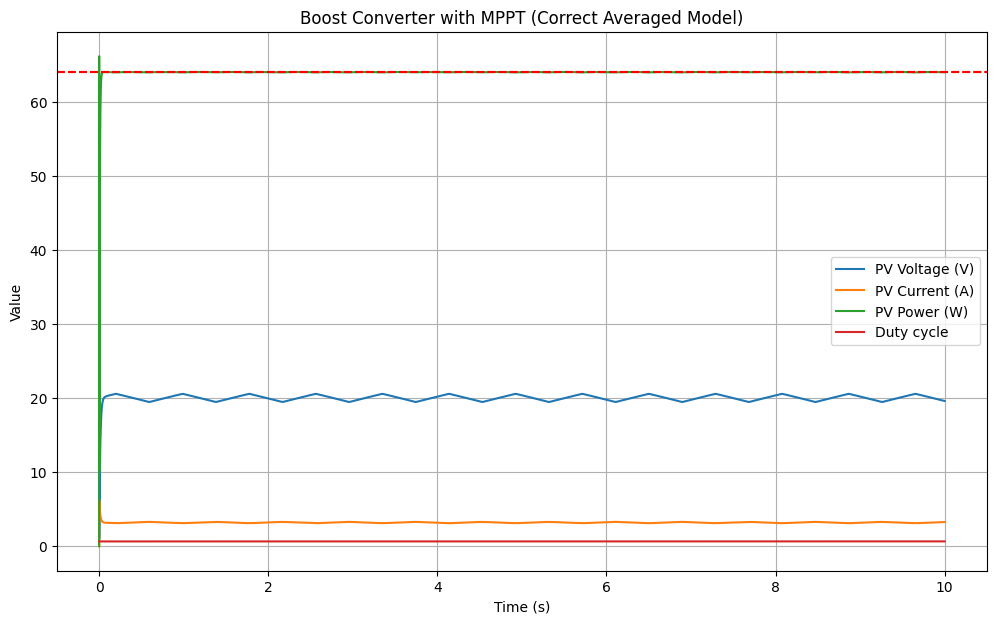
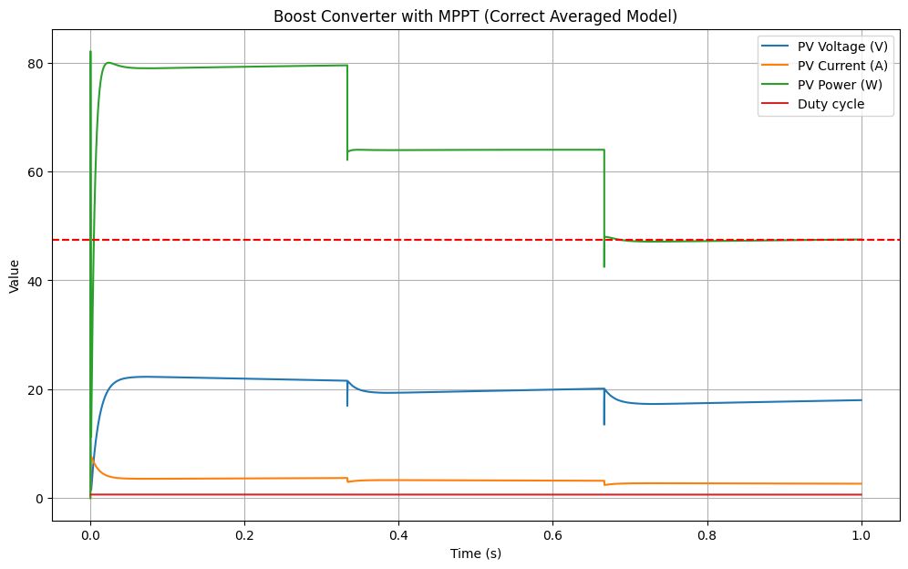
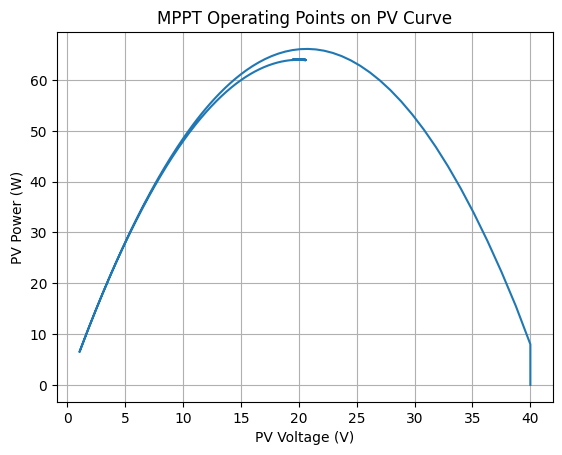

# MPPT Control of a Photovoltaic System using Perturb & Observe Algorithm

## Overview
This project implements and simulates a Maximum Power Point Tracking (MPPT) controller for a photovoltaic (PV) system using the Perturb & Observe (P&O) algorithm. The objective is to maximize energy extraction under varying environmental conditions, particularly irradiance changes.

The system is modeled with a DC-DC power converter and a discrete-time control loop simulating real-world embedded implementation constraints.

---

## Objectives
- Implement a Perturb & Observe MPPT algorithm
- Simulate a PV system under dynamic irradiance conditions
- Evaluate tracking accuracy and transient response
- Analyze system stability and convergence behavior
- Validate algorithm performance under step changes in operating conditions

---

## System Description
The modeled system consists of:

- Photovoltaic source with nonlinear I-V characteristics
- DC-DC converter (controlled via duty cycle modulation)
- LC output filter
- MPPT control loop executed in discrete time

The control strategy adjusts the converter duty cycle based on the sign of the derivative of power with respect to voltage:

- If ΔP > 0 → continue perturbation in the same direction  
- If ΔP < 0 → reverse perturbation direction  

---

## Implementation Details
- Language: Python
- Libraries: NumPy, Matplotlib
- Time-domain discrete simulation
- Fixed sampling time for MPPT loop
- Step irradiance profile used to test dynamic response

Key parameters include:
- Inductance: L = 1 mH  
- Output capacitance: C = 470 µF  
- Sampling time: dt = 50 µs  
- Load resistance: R = 50 Ω  

---

## Results

The system was tested under step changes in irradiance. The MPPT algorithm successfully tracked the Maximum Power Point (MPP) with stable convergence and minimal oscillations around steady state.

### Key observations:
- Fast convergence after irradiance changes
- Stable steady-state oscillations around MPP
- Robust tracking behavior under varying conditions

---

## Discussion
The P&O algorithm performs effectively under slowly varying conditions. However, minor oscillations around the MPP are observed in steady state, which is a known limitation of the method.

Performance was validated under increased simulation duration and varying irradiance levels, confirming stability and repeatability of results.

---

## Future Improvements
- Implementation of Incremental Conductance MPPT for improved accuracy
- Digital filtering of power signal to reduce steady-state oscillations
- Hardware implementation on microcontroller (STM32 / Arduino)
- PWM-based real-time control integration

---

## Author
Embedded systems & electrical engineering student with interest in power electronics, renewable energy systems, and real-time control.